# Semantic Segmentation Project
---
### Overview
---
This project aims to replicate a Fully Convolutional Network(FCN) to label the road pixels in [KITTI Road dataset](http://www.cvlibs.net/datasets/kitti/eval_road.php) images, based on the original CVPR2015 best paper [Fully Convolutional Networks for Semantic Segmentation](https://people.eecs.berkeley.edu/~jonlong/long_shelhamer_fcn.pdf) developed at Berkeley.

Parts of the pre-trained VGG architecture on ImageNet is loaded as encoder of my new FCN, actually, as follows:
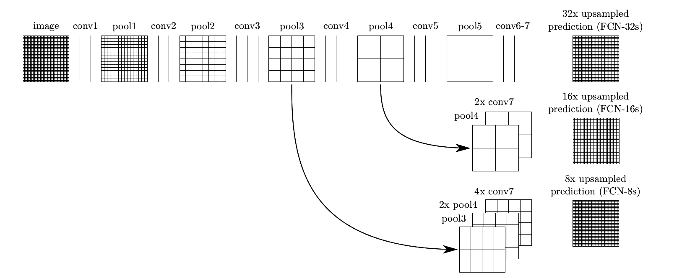

---
### Implementation 
This report is writen with the points on [the rubric](https://review.udacity.com/#!/rubrics/989/view). 

##### Dataset
KITTI dataset uses 160x576 color images, including 289 training images(um_000000.png - um_000094.png, umm_000000-umm_000095.png, and uu_000000.png-uu_000097.png) and  289 testing images(um_000000.png-um_000095.png, umm_000000.png- umm_000093.png and uu_000000.png-uu_000099.png).

##### Architecture
In `main.py`, function `load_vgg()` loads vanila VGG16 and takes useful layers. 

According to the section 4.3 of original paper, there are three types of FCN nets: single-stream, two-stream and three-stream nets based on vanila VGG16. Single stream net upsamples layer7 predictions at stride 32 back to input pixels in a single step. Similarly, two-stream net combines predictions from both last layer 7 and layer4, at stride16. And three-stream net adds layer3 output, at stride 8. Here we apply the three-stream net with the highest accuracy in function `layers()`, following step 1-8. 

-  step 1. fully-connected layer7 is replaced by 1x1 convolutions, perserving spatial information. 
-  step 2. upsampling by deconvolutions/transposed convolution, at stride (2,2)
-  step 3. fully-connected layer4 is replaced by 1x1 convolutions
-  step 4. skip connections - the replaced conv output is added to layer7 upsampled output
-  step 5. upsampling by transposed convolution at stride (2,2)
-  step 6. fully-connected layer 3 is replaced by 1x1 convolutions
-  step 7. skip connections - the replaced output is added to layer4 and layer7 upsampled output 
-  step 8. upsampling by transposed convolution at stride (8,8), then comes the final layer output

Each pair of convolutional layer and deconvolutional layer use a random-normalized initializer with standard deviation 0.01 and a l2 kernel regularizer with penalty 1e-3.

##### Training
After the FCN architecture is built, training is implemented by functions `optimize()` and `train_nn()`.  Adam optimizer is chosen for fewer hyperparameters. All the training and testing are done on AWS cloud computing workspace, deployed by Udacity.  

- **Does the project train the model correctly?**

On average, the model decreases loss over time.  For further analysis, the loss of this FCN for each epoch should be printed and stored while the network is training. You can check more details in `loss log.txt`.

From `loss log.txt` and the next section, you can see the cross-entropy loss starts around 1.7, and decreases to 0.5 after epoch 1. It approaches to 0.1 at epoch 4, then around 0.05 after epoch 9-10. After epoch 20 it approaches to 0.03, and 0.02 after epoch 30. Finally the loss oscilates around 0.02 after epoch 40. All these data shows the FCN can converge sustainably.

- **Does the project use reasonable hyperparameters?**

The hyperparameters `epochs`, `learning_rate` and `batchsize` are set to a reasonable number. Empirically, they are set as follows:

 -- batchsize = 5 
 
According to the traing tips, the VGG model may be larger than some you have used before, so be conscious of your memory usage- you may need to use fairly small batch size in order to avoid running out of memory when training.
 
 -- learning_rate = 0.0001
 
according to original paper.
 
 -- keep_prob = 0.5 
 
 according to my earlier training network experiences.
 
 -- epochs = 1, 10, 20, 30, 40 and 50, respectively.  
 
 It can be seen after epoch 40, the FCN loss oscilates and converges to 0.01-0.02. Here I choose epochs = 50 because this parameter can make more precise predictions in practical. 
 
 epoch = 1
 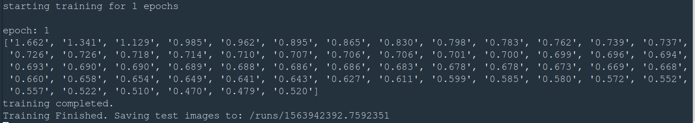
 
 epoch = 10
 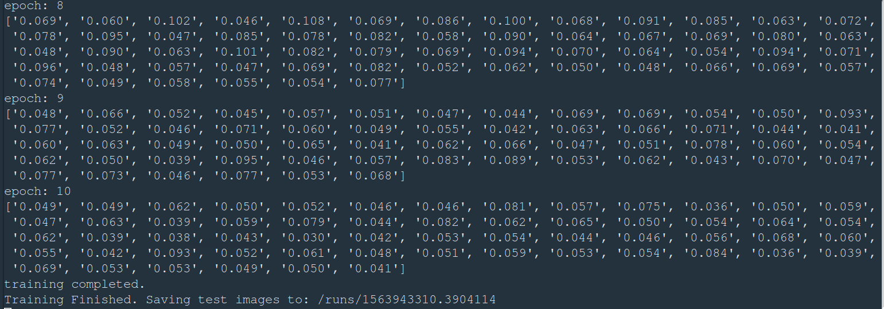
 
 epoch = 20
 
 
 epochs = 30
 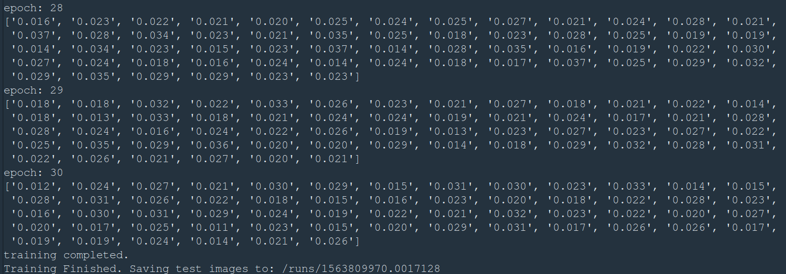
 
 epochs = 40
 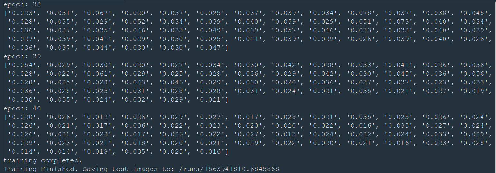
 
 epochs = 50
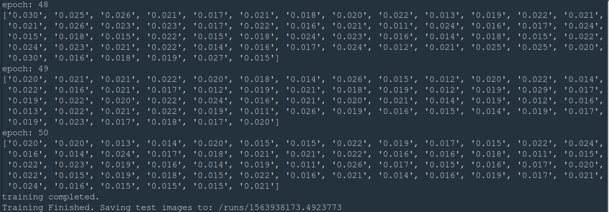

---
### Results

- **First of all, all the tests passed successfully.**

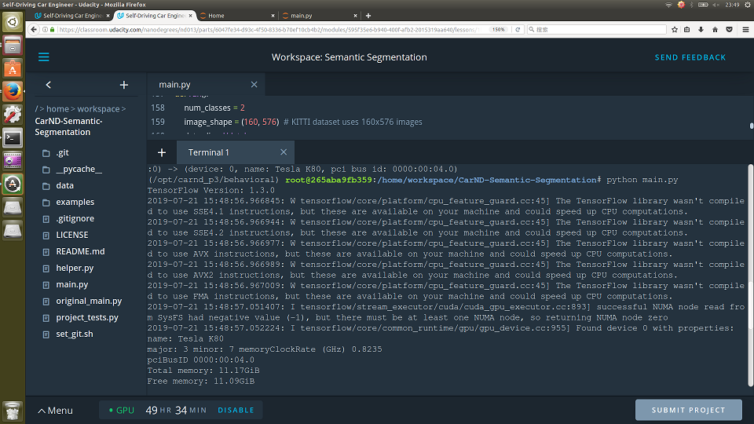
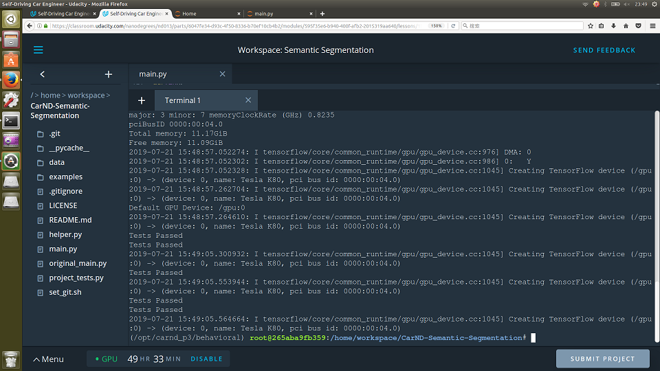

- **Does the project correctly label the road?**

This FCN net aims to label most pixels of roads close to the best solution, and the model doesn't have to predict correctly all the images, just most of them.  A solution that is close to best would label at least 80% of the road and label no more than 20% of non-road pixels as road.

Here are examples of the newest inference images in `/runs` folder  (**all images from the most recent run**) ,  from a trained network, when epochs = 50 :

Some examples about downtown scenes:

downtown 1        | downtown 2
:-------------------------:|:-------------------------:
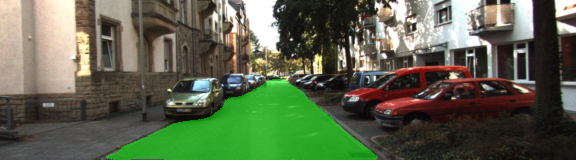  |  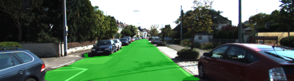

downtown 3        | downtown 4
:-------------------------:|:-------------------------:
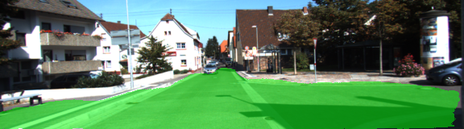  |  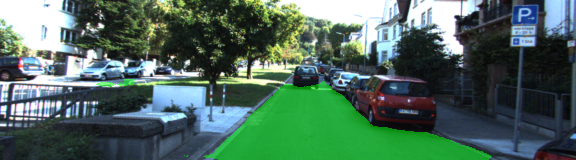

Some samples about downtown scenes with cluttered backgrounds:

downtown with cluttered background  1    | downtown with cluttered background 2
:-------------------------------------------------------:|:-----------------------------------------------------:
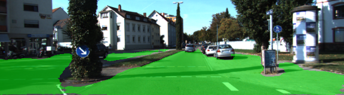  |  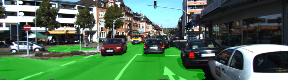

Some samples about downtown scenes with crossroads:

downtown with crossroads 1        | downtown with crossroads 2
:-------------------------:|:-------------------------:
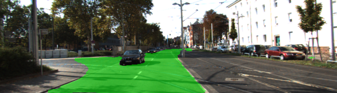  |  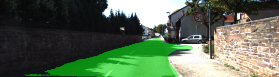

Some suburb scenes:

suburb 1        | suburb 2
:-------------------------:|:-------------------------:
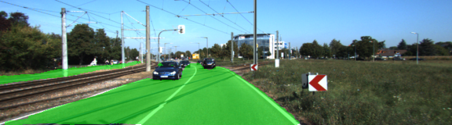  |  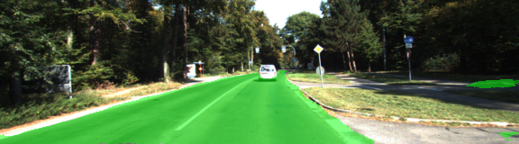

suburb 3        | suburb 4
:-------------------------:|:-------------------------:
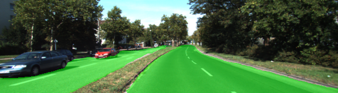  |  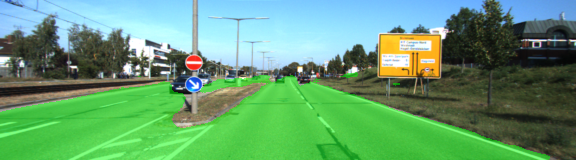

suburb 5       | suburb 6
:-------------------------:|:-------------------------:
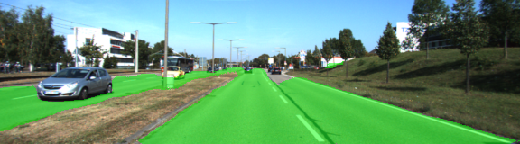  |  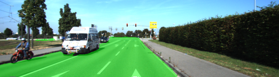

Some suburb scenes with crossroads:

suburb with crossroad 1        | suburb with crossroad 2
:-------------------------:|:-------------------------:
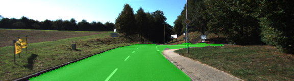  |  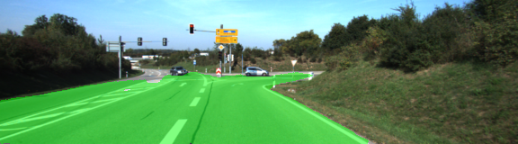

suburb with crossroad 3        | suburb with crossroad 4
:-------------------------:|:-------------------------:
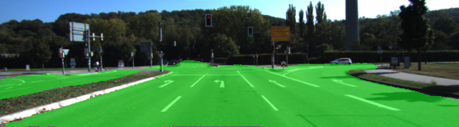  |  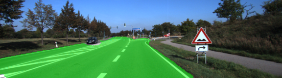

Some suburb scenes with cluttered background:

suburb with clutters 1        | surburb with clutters 2
:-------------------------:|:-------------------------:
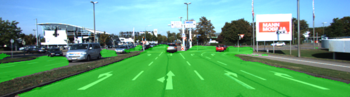  |  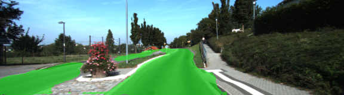

Some suburb scenes with shadow and high sunlight:

suburb with shadow       | suburb with high sunlight
:-------------------------:|:-------------------------:
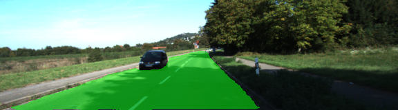  |  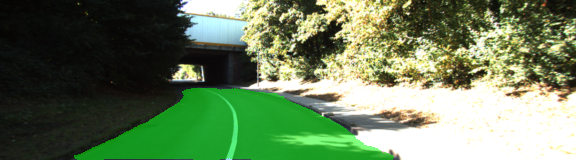

Of course not all the images can be predicted perfectly. Here are some samples with false positive and false negative predictions:

false positive         |  false negative
:-------------------------:|:-------------------------:
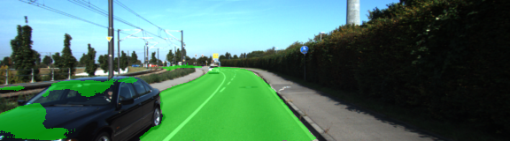  |  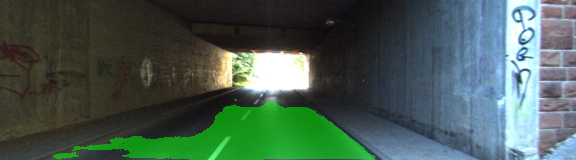

---
### Some training tips
- The link for the frozen `VGG16` model is hardcoded into `helper.py`.  The model can be found [here](https://s3-us-west-1.amazonaws.com/udacity-selfdrivingcar/vgg.zip).
- The model is not vanilla `VGG16`, but a fully convolutional version, which already contains the 1x1 convolutions to replace the fully connected layers. Please see this [post](https://s3-us-west-1.amazonaws.com/udacity-selfdrivingcar/forum_archive/Semantic_Segmentation_advice.pdf) for more information.  A summary of additional points, follow. 
- The original FCN-8s was trained in stages. The authors later uploaded a version that was trained all at once to their GitHub repo.  The version in the GitHub repo has one important difference: The outputs of pooling layers 3 and 4 are scaled before they are fed into the 1x1 convolutions.  As a result, some students have found that the model learns much better with the scaling layers included. The model may not converge substantially faster, but may reach a higher IoU and accuracy. 
- When adding l2-regularization, setting a regularizer in the arguments of the `tf.layers` is not enough. Regularization loss terms must be manually added to your loss function. otherwise regularization is not implemented.
- The VGG model may be larger than some you have used before, so be conscious of your memory usage- you may need to use fairly small batch size in order to avoid running out of memory when training.
- The VGG model, as well as semantic segmentation as a whole, may be slower than previous, simpler models you have constructed. You may want to `print` additional information during trainging to be more aware of progress - depending on batch size and number of batches per epoch, each epoch could be 2-3 minutes or more even with the GPU.
- Given the above, you may consider prototyping on just a subset of the data until you are sure your model works correctly!
